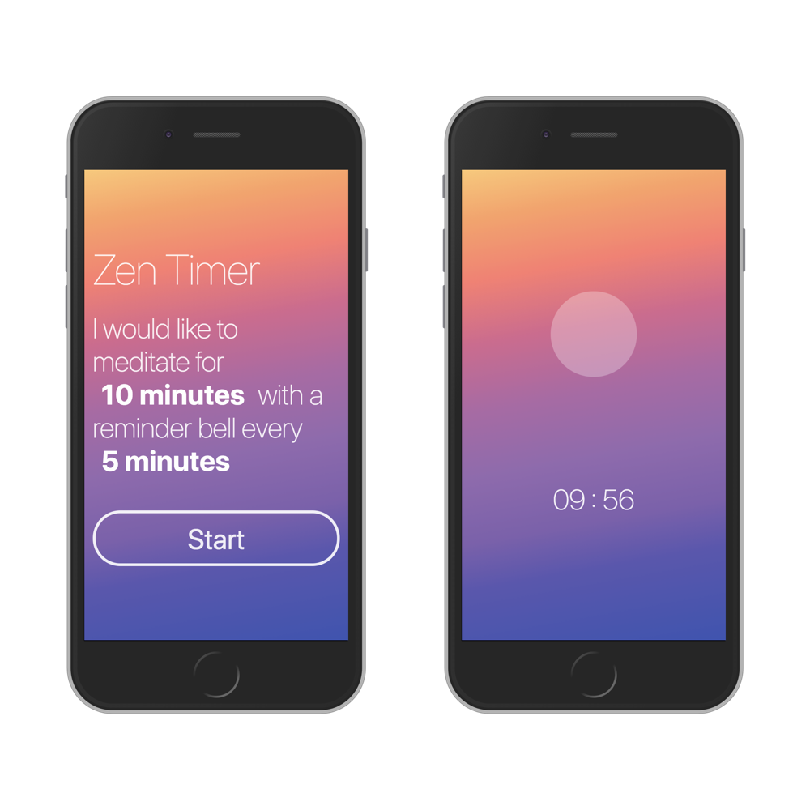

# zen-timer
A simple meditation timer: https://herrbertling.github.io/zen-timer/

## Installation

This project was bootstrapped with [Create React App](https://github.com/facebookincubator/create-react-app). It's not ejected, so everything Create React App brought to this repo is still working :rocket:

### Setting up locally

1. Clone this repository
1. Run `yarn` to install dependencies
1. Run `yarn start`

That should be it – for everything else, please consult the Create React App repo :heart:
